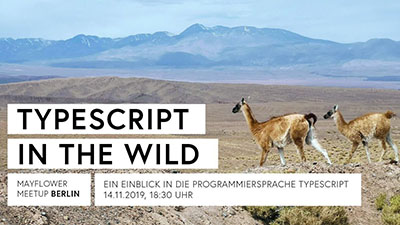
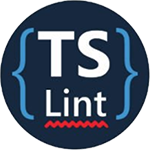

# TypeScript in the Wild

https://www.meetup.com/de-DE/Mayflower-Meetup-Berlin/events/266259645/

Ich stelle Euch in diesem Vortrag die Programmiersprache TypeScript vor und verdeutliche im praktischen Einsatz,
 warum TypeScript der Verwendung von JavaScript als Programmiersprache für die Entwicklung moderner Webapplikationen 
 vorzuziehen ist.

Hierfür gebe ich einen Einblick in die Funktionsweise eines modernen Web-Tech Stacks, der mit Hilfe der Technologien 
 npm, TypeScript und Webpack realisiert wurde. Anhand einer minimalen Beispielanwendung stellt ich Euch die wichtigsten
 Features und Sprachkonstrukte von TypeScript vor und ziehe dabei Parallelen zu anderen bekannten und 
 modernen Hochsprachen.

## Tech Stack
- TypeScript 3.4.5
- Webpack 4.40
- matter.js 0.10.4
- TypeDoc 0.14
- TSLint 5.16

## Online Demo

https://mayflower.github.io/TypeScriptPrimer/dist/

## Installation
Der folgende Befehl installiert alle npm Pakete die der genannte Tech Stack benötigt:

`npm install`

## npm targets

### TypeScript nach JavaScript kompilieren
`npm run typescript:compile`

Kompiliert alle TypeScript Quellcodes von `/src` nach JavaScript unter `/bin`.
 Die Einstellungen für den TypeScript Compiler befinden sich unter `/tsconfig.json`.

### Webpack in development ausführen
`npm run webpack:dev`

Gleiches Verhalten wie Target `typescript:compile`. Darübehinaus werden alle internen
 kompilierten JavaScript Dateien unter `/bin` mit allen externen JavaScript Quellcodes 
 der verwendeten Bibliotheken zusammengefügt und unter `dist/js/bundle.js` vereint.

Nach dem erfolgreichen Abschluss dieses Targets kann das fertige Frontend unter 
 `dist/index.html` betrieben oder deployed werden.

Alle Einstellungen für Webpack siedeln in der `/webpack.config.js` an.

### Webpack in production ausführen
`npm run webpack:production`

Gleiches Verhalten wie das target `webpack:development` nur dass das Kompilat unter
 `dist/js/bundle.js` minifiziert und obfuskiert wird.

### Den Webpack Dev Server starten
`npm run webpack:devserver`

Gleiches Verhalten wie das Target `webpack:development` es wird allerdings kein Output unter
 `bin` oder `dist/js/bundle.js` erstellt. Stattdessen wird die Resource `dist/js/bundle.js`
 virtuell für den Webpack Dev Server zur Verfügung gestellt und der gesamte Ordner `/dist`
 in den Webpack Dev Server gemountet.

Die in den Webpack Dev Server gemountete Frontend Anwendung kann im Browser eingesehen werden
 unter `http://localhost:1234/`

Alle Einstellungen für den Webpack Dev Server befinden sich in der `/webpack.config.js`
 im Abschnitt `config.devServer`.

### TSLint ausführen
`npm run tslint:check`

Führt den TypeScript Linter für alle Quellcodes unter `/src` aus.

Einstellungen für den Linter befinden sich unter `/tslint.json`.

### TypeDoc generieren
`npm run typedoc:generate`

Generiert eine HTML Dokumentation unter `/doc` für alle TypeScript Quellcodes unter `/src/typescript`.

## Hand Outs

### 1. Warum TypeScript?

https://blog.mayflower.de/6135-typescript.html

### 2. Aufsetzen eines Web-Techstacks mit npm, TypeScript und Webpack

https://blog.mayflower.de/6324-typescript-tooling-npm-webpack.html

3. ### TypeScript im Vergleich zu Java

https://blog.mayflower.de/6344-typeacript-java-entwickler.html

4. ### TypeScript Workshop für Einsteiger

https://blog.mayflower.de/6229-typescript-workshop.html
